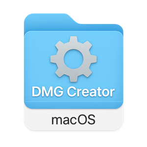
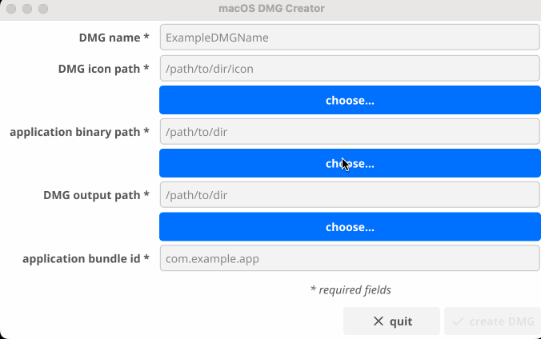
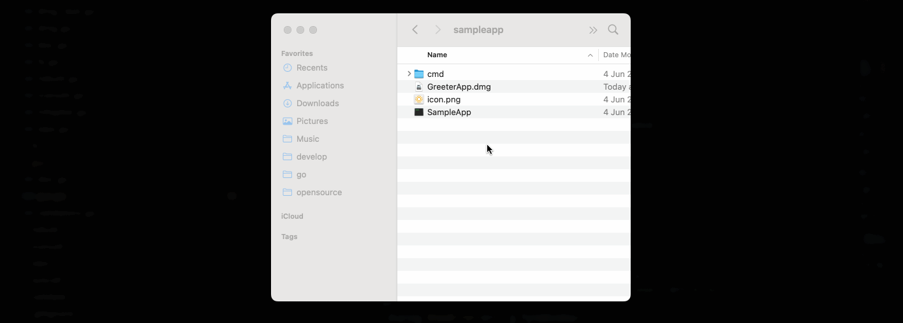

# macos-dmg-creator



A macOS DMG package builder with a native GUI and CLI support. Easily wrap your app binaries into `.app` bundles and generate `.dmg` installers with a custom icon.

Supports Apple Silicon (arm64) out of the box.

---

## features

- simple, native GUI built with [Fyne](https://fyne.io)
- CLI support for automation or scripting
- custom icon support (`.png`, `.jpg`, `.jpeg`, `.gif`, `.tiff`)
- `.app` bundle layout generation
- application symlink for drag-to-install experience
- automatically creates and cleans a temporary working directory
- generates `.dmg` using `hdiutil` behind the scenes

---

## requirements (macOS only)

this tool uses the following native macOS utilities:

- `sips` – used to generate icon sizes
- `iconutil` – used to convert `.iconset` into `.icns`
- `hdiutil` – used to create and convert DMG images

> These tools are pre-installed on macOS. Make sure your `$PATH` includes `/usr/bin`.

---

## GUI Preview

creating a DMG with the graphical app:



---

## CLI Installation

install the CLI binary using `go install`:

```bash
go install github.com/tiagomelo/macos-dmg-creator/cmd/createdmg@latest
````

this installs the binary into your `$GOPATH/bin`.

to confirm your GOPATH:

```bash
go env | grep GOPATH
```

make sure `$GOPATH/bin` is in your system’s `$PATH`.

---

## CLI Usage

after installing, you can use the CLI like this:

```bash
createdmg \
  --appName "GreeterApp" \
  --appBinaryPath "dmg/integration/sampleapp/SampleApp" \
  --bundleIdentifier "info.tiagomelo.greeterapp" \
  --iconPath "dmg/integration/sampleapp/icon.png" \
  --outputDir "dmg/integration/sampleapp"
```

### CLI Flags

| Flag                 | Description                                     | Required |
| -------------------- | ----------------------------------------------- | -------- |
| `--appName`          | Name of your application                        | ✅        |
| `--appBinaryPath`    | Path to your app binary                         | ✅        |
| `--bundleIdentifier` | macOS bundle identifier (e.g. `com.myapp.tool`) | ✅        |
| `--iconPath`         | Path to your `.png`/`.jpg`/`.tiff` icon         | ✅        |
| `--outputDir`        | Directory to write the `.dmg` to                | ✅        |

---

## sample App Preview

installing and running the generated sample `.app` from the DMG:



---

## building the GUI App

```bash
make build-gui-app
```

> **note**: GUI support requires macOS with a graphical environment (Fyne + OpenGL).

---

## supported Architectures

* ✅ macOS ARM64 (Apple Silicon)
* ❌ macOS AMD64 is not currently supported due to [Fyne + CGO + GLFW constraints](https://github.com/fyne-io/fyne/issues)


---

## unit tests

```
make test
```

## unit tests coverage

```
make coverage
```